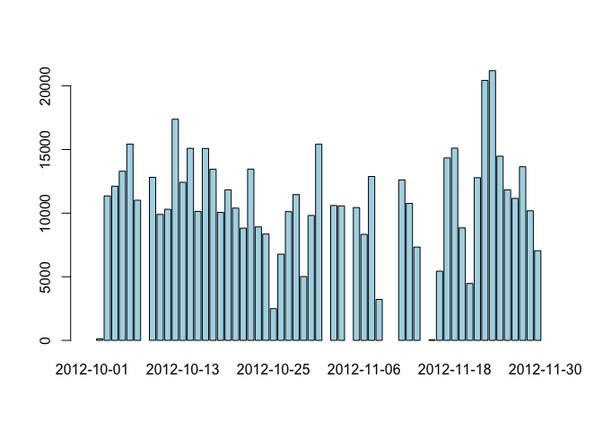
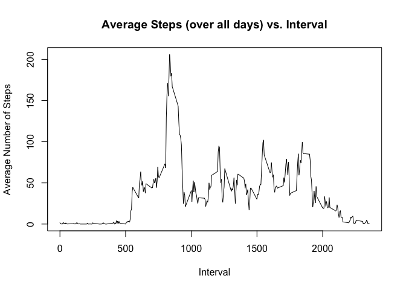
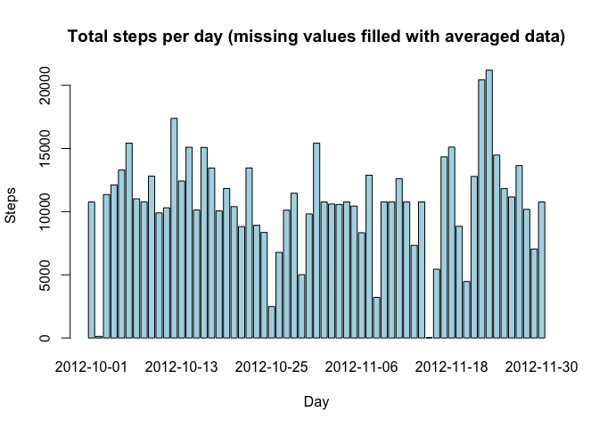

# Reproducible Research: Peer Assessment 1


## Loading and preprocessing the data

```r
unzip("./activity.zip")
pa1_data <- read.csv("./activity.csv")
```

Here is a summary of data

```r
summary(pa1_data)
```

```
##      steps                date          interval     
##  Min.   :  0.00   2012-10-01:  288   Min.   :   0.0  
##  1st Qu.:  0.00   2012-10-02:  288   1st Qu.: 588.8  
##  Median :  0.00   2012-10-03:  288   Median :1177.5  
##  Mean   : 37.38   2012-10-04:  288   Mean   :1177.5  
##  3rd Qu.: 12.00   2012-10-05:  288   3rd Qu.:1766.2  
##  Max.   :806.00   2012-10-06:  288   Max.   :2355.0  
##  NA's   :2304     (Other)   :15840
```


## What is mean total number of steps taken per day?

Plotting the total number of steps per day

```r
perday <- tapply(pa1_data$steps, pa1_data$date, sum)
barplot(perday, col = "lightblue")
```

 

The mean total number of steps taken per day is

```r
mean(perday, na.rm = TRUE)
```

```
## [1] 10766.19
```

The median total number of steps taken per day is

```r
median(perday,  na.rm = TRUE)
```

```
## [1] 10765
```

## What is the average daily activity pattern?

To plot the number of steps taken averaged across all days vs the 5 minute interval first w(I remove missing values when taking the average across all days):

```r
perint <- tapply(pa1_data$steps, pa1_data$interval, mean, na.rm=TRUE)
plot(unique(pa1_data$interval), perint, type = "l")
```

 

We see from the graphics that on the average, the maximum number of steps is taken in the morning, between 8am and 9am. To get the exact value we select the maximun averaged steps, then subset the vector containing the  

```r
m <- max(perint)
perint[perint == m]
```

```
##      835 
## 206.1698
```

On the average the maximum number of steps is taken in the interval starting at 8:45am.


## Imputing missing values

Let's compute the total number of missing values in the dataframe

```r
sum(is.na(pa1_data$steps))
```

```
## [1] 2304
```
Now let's check that there are no NA in the date or interval columns:

```r
sum(is.na(pa1_data$date))
```

```
## [1] 0
```

```r
sum(is.na(pa1_data$interval))
```

```
## [1] 0
```

Let's fill in all the missing values in the dataset by replacing each NA with the average value for that interval computed across all days


```r
pa1_filled <- pa1_data
for(i in 1:nrow(pa1_filled)) {
        if(is.na(pa1_filled[i,]$steps))
            pa1_filled[i,]$steps <- as.numeric(perint[as.character(pa1_data[i,]$interval)])    
}
```

Now let's make an histogram of the total number of steps taken each day with the new data

```r
steps_per_day_2 <- tapply(pa1_filled$steps, pa1_filled$date, sum)
barplot(steps_per_day_2, col = "lightblue")
```

 

The averaged total number of steps taken per day is:

```r
mean(steps_per_day_2, na.rm = TRUE)
```

```
## [1] 10766.19
```

The median total number of steps taken per day is now:

```r
median(steps_per_day_2,  na.rm = TRUE)
```

```
## [1] 10766.19
```

## Are there differences in activity patterns between weekdays and weekends?
