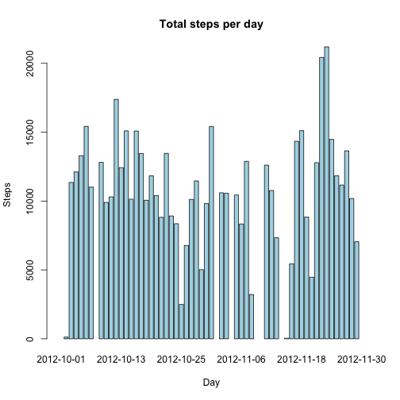
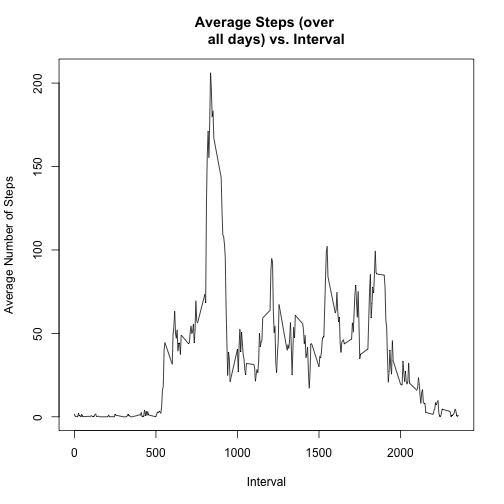
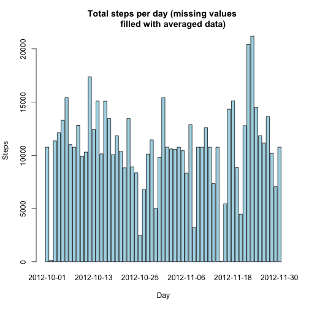
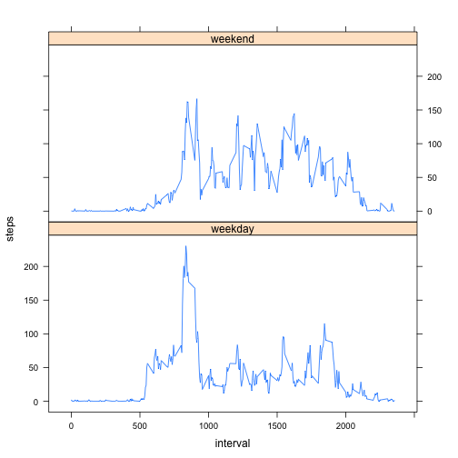

## Loading and preprocessing the data

```r
unzip("./activity.zip")
pa1_data <- read.csv("./activity.csv")
```

Here is a summary of data

```r
str(pa1_data)
```

```
## 'data.frame':	17568 obs. of  3 variables:
##  $ steps   : int  NA NA NA NA NA NA NA NA NA NA ...
##  $ date    : Factor w/ 61 levels "2012-10-01","2012-10-02",..: 1 1 1 1 1 1 1 1 1 1 ...
##  $ interval: int  0 5 10 15 20 25 30 35 40 45 ...
```

Variable date is of type factor. It might be convenient to convert it to a Date object:

```r
 pa1_data$date <- strptime(pa1_data$date, format = "%Y-%m-%d")
str(pa1_data)
```

```
## 'data.frame':	17568 obs. of  3 variables:
##  $ steps   : int  NA NA NA NA NA NA NA NA NA NA ...
##  $ date    : POSIXlt, format: "2012-10-01" "2012-10-01" ...
##  $ interval: int  0 5 10 15 20 25 30 35 40 45 ...
```


## What is mean total number of steps taken per day?

Let's plot the total number of steps per day

```r
steps_per_day <- tapply(pa1_data$steps, as.character(pa1_data$date), sum)
barplot(steps_per_day, col = "lightblue", main = "Total steps per day", xlab = "Day", ylab = "Steps")
```

 

The mean and median total number of steps taken per day are (let's remove the missing values to get a meaningful result. Leaving na.rm = FALSE as of default would provide NA values both for the mean and for the median):

```r
mean(steps_per_day, na.rm = TRUE)
```

```
## [1] 10766.19
```

```r
median(steps_per_day, na.rm = TRUE)
```

```
## [1] 10765
```

## What is the average daily activity pattern?

Let's plot the number of steps taken averaged across all days vs the 5 minute intervals  (I remove missing values when taking the average across all days):

```r
steps_per_int <- tapply(pa1_data$steps, pa1_data$interval, mean, na.rm=TRUE)
plot(unique(pa1_data$interval), steps_per_int, type = "l", main = "Average Steps (over 
     all days) vs. Interval", xlab = "Interval", ylab = "Average Number of Steps")
```

 

We see from the graphics that on the average, the maximum number of steps is taken in the morning, between 8am and 9am. To get the exact value we select the maximum averaged steps, then subset the vector containing the  

```r
m <- max(steps_per_int)
steps_per_int[steps_per_int == m]
```

```
##      835 
## 206.1698
```

On the average the maximum number of steps (206) is taken in the interval between 8:45am and 8:50am.


## Imputing missing values

Let's compute the total number of missing values in the data frame

```r
sum(is.na(pa1_data$steps))
```

```
## [1] 2304
```
Now let's check that there are no NA in the date or interval columns:

```r
sum(is.na(pa1_data$date))
```

```
## [1] 0
```

```r
sum(is.na(pa1_data$interval))
```

```
## [1] 0
```

Let's fill in all the missing values in the data set by replacing each NA with the average value for that interval computed across all days:

```r
pa1_filled <- pa1_data
for(i in 1:nrow(pa1_filled)) {
        if(is.na(pa1_filled[i,]$steps))
            pa1_filled[i,]$steps <- as.numeric(steps_per_int[as.character(pa1_data[i,]$interval)])    
}
```

Now let's make an histogram of the total number of steps taken each day with the new data

```r
steps_per_day_2 <- tapply(pa1_filled$steps, as.character(pa1_filled$date), sum)
barplot(steps_per_day_2, col = "lightblue", main = "Total steps per day (missing values 
        filled with averaged data)", xlab = "Day", ylab = "Steps")
```

 

After filling the missing values in with averaged data, the mean and median total number of steps taken per day are:

```r
mean(steps_per_day_2)
```

```
## [1] 10766.19
```

```r
median(steps_per_day_2)
```

```
## [1] 10766.19
```
We notice just a slight modification of the median value, which makes sense because with the choice made above we are replacing the missing total steps per day values with the average value itself.


## Are there differences in activity patterns between weekdays and weekends?

Let's create a new variable differentiating between weekdays and weekend

```r
for(i in 1:nrow(pa1_filled)) {
        if(weekdays(pa1_filled$date[i]) == "Saturday" || weekdays(pa1_filled$date[i]) == "Sunday" ) 
                pa1_filled$day[i] <- "weekend"
        else pa1_filled$day[i] <- "weekday"        
}
```

To check the differences in activity pattern between weekdays and weekend, let's aggregate data taking the average of the number of steps in each interval over weekdays and weekend, then let's plot the averaged values:

```r
library(lattice)
aggregate_data <- aggregate (steps ~ interval + day, pa1_filled,mean)
aggregate_data <- transform(aggregate_data, day = factor(day))
xyplot(steps ~ interval | day, data = aggregate_data, type = "l", layout = c(1,2))
```

 

We notice that during weekdays the activity is more concentrated in the morning, while during weekends steps are spread more evenly over the day.
